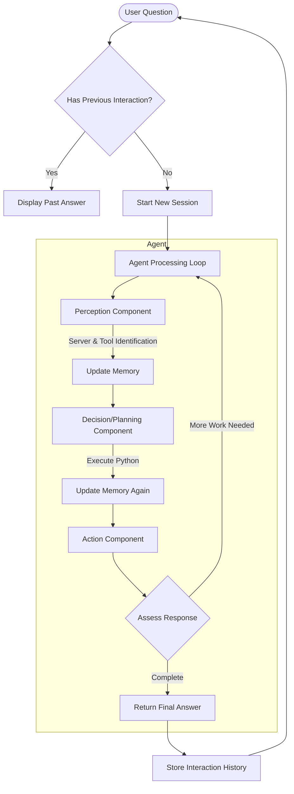

For a detailed view of the execution logs for these queries, please refer to:

- **"summarize this page https://en.wikipedia.org/wiki/Valorant"** (see lines [19–84](https://github.com/Shiva082002/EAG-Session-9-Assignment-/blob/main/Executionlog.log#L19-L84))
- **"what is Adequate development in paragraph development search in documents"** (see lines [97–156](https://github.com/Shiva082002/EAG-Session-9-Assignment-/blob/main/Executionlog.log#L97-L156))
- **"At the heart of the Whispering Caves what fin found serach in the documents"** (see lines [163–227](https://github.com/Shiva082002/EAG-Session-9-Assignment-/blob/main/Executionlog.log#L163-L227))

You can find the full execution log here:

[Full Execution Log](https://github.com/Shiva082002/EAG-Session-9-Assignment-/blob/main/Executionlog.log)


# Cortex-R Agent

Cortex-R Agent is a sophisticated AI framework designed for advanced reasoning, persistent memory, and multi-step task execution. It leverages a modular, tool-based architecture to deliver robust, context-aware solutions to user queries.

## Overview

Cortex-R processes user queries through a perception-planning-action loop, enabling the agent to:

1. Recall previous conversations and provide contextually relevant answers from its memory
2. Utilize a diverse set of tools to solve complex, multi-step problems
3. Apply a comprehensive suite of heuristics to sanitize inputs and enhance output quality
4. Dynamically execute Python code to address user requests

## Architecture

The agent operates using a perception-planning-action loop, tightly integrated with a memory system to ensure continuity and learning over time.



### Core Components

1. **Agent Loop** (`core/loop.py`): Coordinates the overall workflow and manages the iterative interaction between modules.
2. **Perception Module** (`modules/perception.py`): Processes and interprets user queries, identifies user intent, and determines the most relevant tools or services.
3. **Decision Module** (`modules/decision.py`): Develops executable Python tasks or plans based on the processed understanding from the Perception Module.
4. **Action Module** (`modules/action.py`): Executes the generated tasks within a secure and isolated environment.
5. **Memory System** (`modules/memory.py`): Stores conversation history, session data, and context to ensure consistent and seamless interactions.
6. **Input/Output Heuristics** (`core/heuristics.py`): Validates and refines both input and output data, applying transformation and formatting rules for optimal performance.

## Key Features

### 1. Persistent Conversation Memory

Cortex-R maintains a comprehensive history of all past interactions in `historical_conversation_store.json`, enabling it to:
- Instantly recall answers to previously addressed or related queries
- Offer users the choice between cached responses or a fresh solution
- Gradually enhance and expand its knowledge base through ongoing conversations

### 2. Advanced Heuristic Validation

The agent applies 15 carefully crafted heuristic rules to verify and improve the quality, safety, and reliability of both user inputs and LLM-generated responses.

**Input Heuristics:**
- Enforces input length limits to prevent context overflow
- Filters banned or unsafe words to maintain system integrity
- Redacts sensitive information such as PII and credentials
- Normalizes queries for improved matching with historical data
- Detects and reformats mathematical expressions for clarity
- Identifies and flags unsafe code patterns (e.g., `os.system`, `eval`, file writes)
- Validates and corrects JSON strings for proper formatting
- Detects potential infinite loops and inserts safety counters
- Adds bounds and key checks for safe collection access
- Enforces consistent variable naming conventions

**Output Heuristics:**
- Validates that responses are structured as proper `solve()` functions
- Extracts executable code from markdown-formatted responses
- Automatically adds missing import statements
- Ensures return statements follow the required format
- Checks for proper use of `await` in asynchronous calls

### 3. Optimized Decision Prompting

A well-designed decision prompt (around 300 words in length) steers the LLM to produce precise, executable Python code while maintaining clarity and ensuring correctness in responses.

### 4. Multi-Tool and Modular Integration

Cortex-R effortlessly integrates with various Modular Capability Provider (MCP) servers, each offering specialized services for:
- Mathematical computations
- Document retrieval and extraction
- Web search and summarization
- Memory management and historical data access

## Usage

### Running the Agent

To start the agent, run:

```bash
python agent.py
```

You will be guided through interactive prompts. The agent will:
1. Check if your query has been previously answered
2. Offer to show the cached answer or compute a new one
3. If no match is found, it will process your query using the full perception-planning-action loop

### Example Interactions

Upon startup, you will see:

```bash
🧠 Cortex-R Agent Ready
🧑 What do you want to solve today? →
```

Example queries you might try:
For a detailed view of the execution logs for these queries, please refer to:

- **"summarize this page https://en.wikipedia.org/wiki/Valorant"** (see lines [19–84](https://github.com/Shiva082002/EAG-Session-9-Assignment-/blob/main/Executionlog.log#L19-L84))
- **"what is Adequate development in paragraph development search in documents"** (see lines [97–156](https://github.com/Shiva082002/EAG-Session-9-Assignment-/blob/main/Executionlog.log#L97-L156))
- **"At the heart of the Whispering Caves what fin found serach in the documents"** (see lines [163–227](https://github.com/Shiva082002/EAG-Session-9-Assignment-/blob/main/Executionlog.log#L163-L227))

You can find the full execution log here:

[Full Execution Log](https://github.com/Shiva082002/EAG-Session-9-Assignment-/blob/main/Executionlog.log)


The agent will clearly show its reasoning steps and deliver a final, actionable answer.


## Acknowledgments

Cortex-R Agent is inspired by leading architectural patterns in AI agent design, combining:
- Tool-based planning and execution
- Persistent memory and conversation history
- Rigorous input/output validation heuristics
- Secure, dynamic Python code execution
